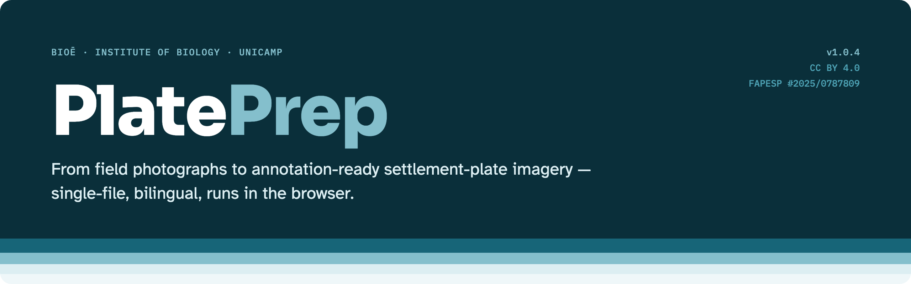
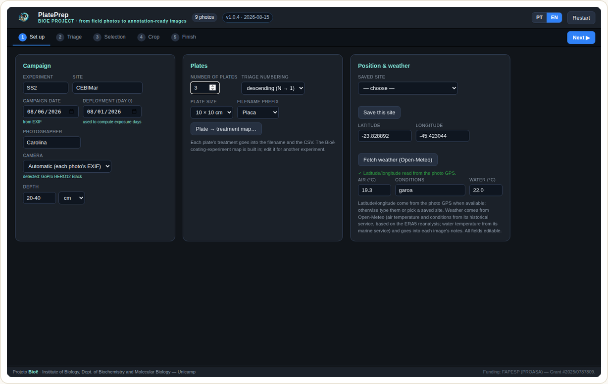
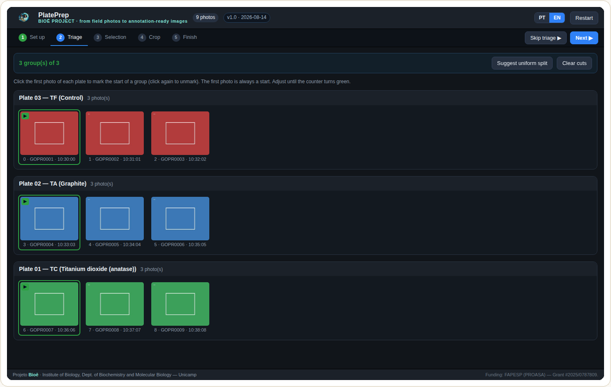
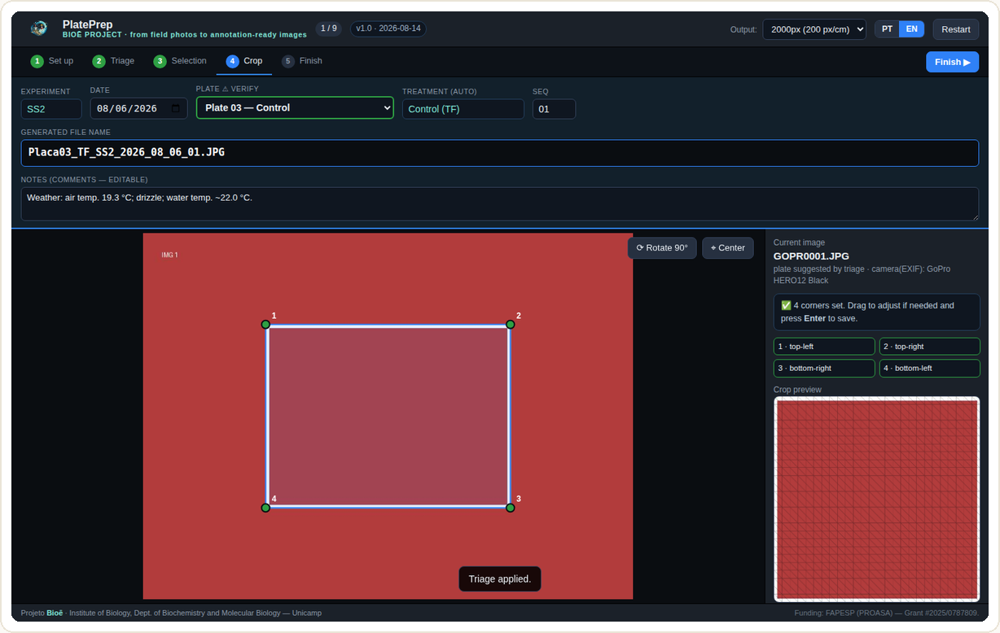
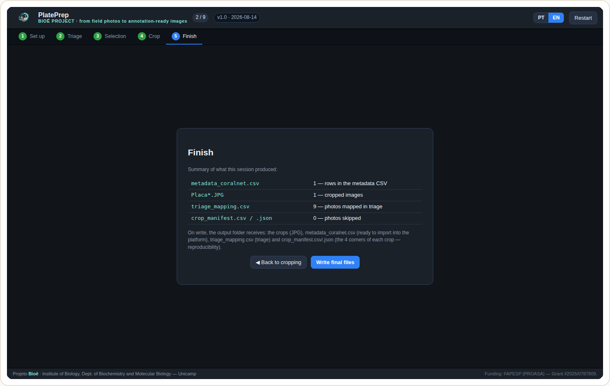
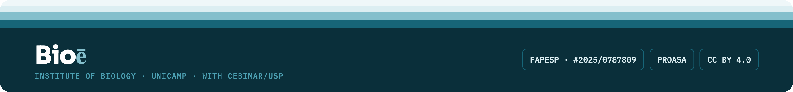

     

**Das fotos de campo à imagem de placa de assentamento pronta para anotação — no navegador.**

*[English version → README.md](README.md)*

O PlatePrep prepara as fotos de uma campanha de **placas de assentamento** para anotação no
[CoralNet](https://coralnet.ucsd.edu) e em outras plataformas, num único fluxo guiado de
navegador: metadados da campanha → triagem por placa → seleção → recorte com correção de
perspectiva e escala fixa → imagens nomeadas + CSVs prontos para importar + manifesto com a
geometria de cada recorte.

- **Arquivo único, sem instalação** — `PlatePrep.html` roda em qualquer navegador desktop baseado
  em Chromium.
- Interface **bilíngue** (português / inglês), alternável a qualquer momento.
- **As fotos não saem do seu computador** — todo o processamento é local. A única chamada externa
  opcional é a busca de clima (Open-Meteo).
- **Reprodutível por construção** — os 4 cantos-fonte de cada recorte ficam registrados num
  manifesto; qualquer recorte pode ser re-derivado e erros de operador podem ser triados sem
  reinspecionar imagens.

**Experimente agora:** <https://www.projetobioe.com/plateprep.html> (instância hospedada, HTTPS)

## O fluxo em 5 etapas

| Etapa | O que acontece |
|---|---|
| **1 · Configurar** | Experimento, local, fotógrafo, profundidade, nº de placas, tamanho da placa e mapa placa → tratamento. **Data, câmera e GPS vêm do EXIF** das fotos; sem GPS (ex.: GoPro HERO12), digite as coordenadas ou escolha um **sítio salvo**. Um clique busca o **clima no Open-Meteo** (ar e condições do serviço histórico, baseado na reanálise ERA5; temperatura da água do serviço marinho). Tudo editável. |
| **2 · Triagem** *(opcional)* | As fotos da campanha em sequência, com a hora do EXIF; clique na **primeira foto de cada placa** e o programa agrupa e numera o resto. Pode ser pulada. |
| **3 · Seleção** | Galeria de miniaturas; cada foto mostra a placa da triagem; marque as que serão recortadas (as já cortadas vêm desmarcadas). |
| **4 · Recorte** | Clique os 4 cantos da placa → retificação por homografia com **escala fixa** (lado da imagem = lado da placa). A placa vem preenchida pela triagem; tratamento, nome e sequência são automáticos. `Enter` salva e avança. |
| **5 · Finalizar** | A pasta de saída recebe os recortes (`Placa##_T?_EXP_AAAA_MM_DD_##.JPG`, escala embutida no cabeçalho JFIF), **`metadata_coralnet.csv`** (pronto para importar), **`triage_mapping.csv`**, **`crop_manifest.csv/.json`** (os 4 cantos de cada recorte) e **`PlatePrep_ImageJ_scale.ijm`** (macro de calibração do ImageJ). |

### O fluxo, em imagens

<table><tr><td width="50%"> <b>1 · Configurar</b> — metadados da campanha pré-preenchidos do EXIF/GPS; clima com um clique (Open-Meteo).</td><td width="50%"> <b>2 · Triagem</b> — clique na primeira foto de cada placa; o resto é agrupado e numerado.</td></tr><tr><td> <b>4 · Recorte</b> — quatro cantos → homografia em escala fixa; placa herdada da triagem; nome e notas automáticos.</td><td> <b>5 · Finalizar</b> — recortes, CSV de metadados, mapa da triagem e manifesto gravados na pasta de saída.</td></tr></table>

Instruções completas, com capturas de tela, nos manuais: [`docs/Manual_PlatePrep_PT.pdf`](docs/Manual_PlatePrep_PT.pdf) · [`docs/Manual_PlatePrep_EN.pdf`](docs/Manual_PlatePrep_EN.pdf).

## Começando

**Use a instância hospedada** (recomendado): abra <https://www.projetobioe.com/plateprep.html> no
Google Chrome ou Microsoft Edge, clique em *Escolher pastas e começar* e selecione a pasta de
entrada (fotos da campanha, JPG/PNG) e uma pasta de saída.

**Ou rode você mesmo:** baixe [`PlatePrep.html`](PlatePrep.html) e abra no Chrome. O acesso direto
às pastas usa a API File System Access, que exige contexto seguro (HTTPS ou `localhost`); aberto
por `file://` o navegador pode restringir o acesso a pastas — nesse caso o PlatePrep empacota os
resultados num `.zip` para download. Para hospedar, sirva o arquivo único como estático em HTTPS —
sem build, sem backend.

### Requisitos

- Navegador **desktop** baseado em Chromium (Chrome, Edge). Outros caem no modo `.zip`.
- Fotos disponíveis no disco local (no Google Drive, marque *Disponível off-line*).
- Internet só para a busca opcional de clima (e para o modo `.zip`, que carrega o JSZip de um CDN);
  todos os campos podem ser preenchidos à mão.

## Saídas

| Arquivo | Conteúdo |
|---|---|
| `Placa##_T<letra>_<EXP>_<AAAA>_<MM>_<DD>_<seq>.JPG` | Recortes quadrados, perspectiva corrigida, escala fixa (prefixo `Placa`/`Plate` configurável). Nomes autoexplicativos e parseáveis. **A escala física (px/cm) vai embutida no cabeçalho JFIF do JPEG** — nada é desenhado sobre a imagem; Photoshop, GIMP, QGIS, Python/PIL etc. abrem o recorte já calibrado. |
| `metadata_coralnet.csv` | Um registro por imagem com as colunas que o CoralNet importa: `Name, Date, Experiment, Site, Treatment, Exposure_Days, Plate, Height (cm), Latitude, Longitude, Depth, Camera, Photographer, Water quality, Strobes, Framing gear used, White balance card, Comments`. `Exposure_Days` calculado da data de instalação; `Comments` traz o clima do dia. |
| `triage_mapping.csv` | Foto original → placa / tratamento / sequência — registro permanente do log fotográfico da campanha. |
| `crop_manifest.csv` / `.json` | Para cada recorte: os 4 cantos na imagem-fonte, dimensões da fonte, tamanho da saída, tamanho da placa e px/cm. Re-derive qualquer recorte; quantifique variabilidade entre operadores só com os manifestos. |
| `PlatePrep_ImageJ_scale.ijm` | Macro do ImageJ/Fiji que define a calibração espacial global dos recortes da campanha (`Set Scale… distance=<px> known=<cm> unit=cm global`). O leitor JPEG do ImageJ ignora a densidade JFIF; rode uma vez por sessão (*Plugins › Macros › Run…*). |

O mapa placa → tratamento do experimento de revestimentos do Bioē (30 placas, tratamentos A–F) vem
embutido como modelo e é totalmente editável — inclusive a legenda — para qualquer outro experimento.

## Limitações conhecidas (v1.0.5)

- Pressupõe placas planas, aproximadamente quadradas, com os 4 cantos visíveis; a marcação dos
  cantos é manual (detecção automática está no roadmap).
- Fotos com mais de 3600 px de largura são decodificadas a 3600 px por economia de memória
  (`MAX_DECODE_W`); o manifesto registra as dimensões da tela de trabalho. Decodificação em
  resolução nativa prevista para a v1.1.
- A reamostragem passa por uma malha afim por partes 26 × 26, que deixa uma estrutura periódica
  tênue no passo da malha — inócua para contagem de pontos, mas visível a análises de textura.
  Renderização por pixel pela homografia exata prevista para a v1.1.
- Os dados de clima atrasam alguns dias (ERA5); campanhas recentes preenchem-se à mão.

## Como citar

Se usar o PlatePrep, cite a versão arquivada do software:

> Galembeck, E. & Schlosser, C. F. (2026). *PlatePrep: browser-based preparation of settlement-plate imagery for annotation platforms* (v1.0.5) [Software]. Zenodo. https://doi.org/10.5281/zenodo.21959574

DOI conceitual (sempre resolve para a versão mais recente): https://doi.org/10.5281/zenodo.21959574 · Metadados
legíveis por máquina em [`CITATION.cff`](CITATION.cff) (botão *Cite this repository* do GitHub). Um
artigo de métodos descrevendo e validando o pipeline está em submissão; esta seção será atualizada
com a referência.

## Contribuindo

Issues e pull requests são bem-vindos. O PlatePrep é um único arquivo HTML autocontido; a
retificação (`solveH`, `warpTo`), o EXIF, o CSV e o manifesto são JavaScript puro, sem
dependências. Ao relatar um bug, descreva o navegador e anexe um conjunto mínimo de fotos.

## Licença e créditos

**CC BY 4.0** — ver [`LICENSE`](LICENSE).

**Projeto Bioē** — Instituto de Biologia da Unicamp, Departamento de Bioquímica e Biologia
Molecular, com o Centro de Biologia Marinha (CEBIMar/USP). Financiamento: FAPESP — *Technological
Innovation Programs / PROASA – Program for the South Atlantic Ocean and Antarctic Sciences*,
Research Project – Regular, Call for Proposals (2025), 1st Cycle, processo **#2025/0787809**.

Dados de clima: [Open-Meteo](https://open-meteo.com) (serviço histórico baseado na reanálise ERA5;
serviço marinho).

